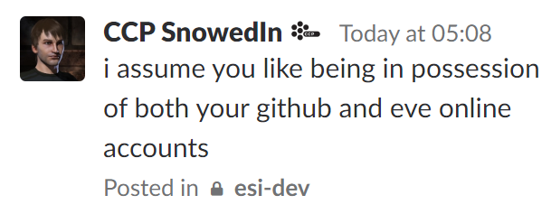

## An interesting day

May 17th. What I expected to be a perfectly boring day, turned out to be fairly interesting. This was due to EVE Online, but not because of a thrilling fight or something, as so far today, I haven’t logged in any of my characters. Let me take you through it.

11:44, waking up, then starting my day by taking a shower and streaming a couple newly released episodes of some shows I’m watching.

14:33, my phone disturbs me with a notification. I look at it, and it’s a mail from EVE Online, with the subject line *Subscription Renewal Success*. That’s not right. My Omega game time was supposed expire around today, but not be renewed… Oh.

In the past, whenever you were buying some game time at your EVE Online’s [Account Management](https://secure.eveonline.com/) site, before you completed a purchase, there was a small checkbox which allowed you to select whether it would be a one-time purchase, or a recurring subscription. This has now been removed, and the only way to make a one-time purchase of game time is to start a subscription, and then cancel it immediately after, the second step being very easy to forget about. I see this as another in a string of changes made by CCP for marketing reasons, despite the big reduction in the level of UX the players would suffer.

This was not something I would stand for. Getting the checkbox back may be too big a task for me to accomplish in one day, but getting my subscription refunded certainly isn’t.

15:48, I submitted a strongly, but politely, worded support ticket, expressing my discontent at the situation, noting that I’ve been in a similar situation about a year ago, and that I would like to have the payment refunded.

16:05, I received a response to the ticket. The responding GM told me he had reverted my account to Alpha state, and will be refunding the payment as soon as possible.

It occurs to me that going back to Alpha state may not be such a great idea, as tomorrow, the 18th, we have a fleet announced for the final timer of PL’s 9UY Fortizar. Eh, I suppose Machariels are an Alpha friendly ship, and it’s not like PL will be mounting a serious resistance.

16:15, CCP SnowedIn made an announcement in a private channel on Tweetfleet Slack, soon to be followed by this tweet:

> [Tweet by CCP SnowedIn on May 17, 2018](https://twitter.com/CCP_SnowedIn/status/997119502889332736):
>
> #tweetfleet #devfleet the ESI-issues repo has moved under the newly created ESI github organization. your old links should be redirected to https://github.com/esi/esi-issues

Why was it moved, though?

As announced during the [ESI — State of the API](https://drive.google.com/file/d/1X-UggTl2bVJRXzJeVJrvPnNcfX0zKpmS/view) presentation at this year’s Fanfest, Team Tech Co was looking into delegating the moderation of the [esi-issues](https://github.com/esi/esi-issues) repository. They did it. 14 third-party developers, selected for their exceptional levels of activity or proficiency with ESI (I assume, some of the choices seem fairly arbitrary to me), were invited into a [new GitHub organization](https://github.com/esi), and today, the control of esi-issues and several other ESI related repositories was handed over to that organization. I’m one of [the 14](https://i.imgur.com/JboGyjY.png).

One of the guiding thoughts behind the initiative was for it not to be part of [the ISD](https://volunteers.eveonline.com/). Team Tech Co wanted to avoid the strict rules and complicated reward schemes of the ISD (Do they even intend to give us some kind of rewards for our efforts?) or requiring us to sign NDA’s (If you ignore the one we already have as part of the [Developer License Agreement](https://developers.eveonline.com/license-agreement).) What we’ve got is a fairly informal group of capable individuals, which has, in the several hours it has been at work, already done some nice work.

> 
> CCP SnowedIn, late last night/early this morning, responding to my question about the measures in place to stop one of us from griefing the repository. Point taken, but you still haven’t answered my question.

16:18, my newly gained powers had already corrupted me, and I used them, for the first time, to close a [duplicate feature request](https://github.com/esi/esi-issues/issues/919) in esi-issues.

16:52, impressed by the response time on my previous ticket, I sent another one in, related to a matter I’ve been putting off for a while. Time for a trip down memory lane.

If I asked you what my first PvP loss was, by looking at my killboard, you might say that it was this [Thorax](https://zkillboard.com/kill/30320510/), lost in lowsec while *defending* a corporation mining op. That would not be true. In fact, when I first started my account, I had an entirely different character. What happened to that character? I lost a ship with all my stuff in it, and decided to biomass it.

Problem is, I couldn’t point you to that loss if I wanted to. I couldn’t remember the name of the character in the slightest, and details of the loss were hazy. That’s where EVE’s customer support comes in. In the new ticket, I basically asked for the name of the first character I created on my account (and soon after biomassed), and inquired about the possibility of having it restored.

17:40, the response is here. The responding GM, GM Sirius (incidentally, the same one who responded to my earlier ticket), replied with a list of all characters I had biomassed on that account. The name immediately popped out. [Tony Uta](https://zkillboard.com/character/93257854/). I hurried to type it into zKillboard, and there it was. A [Cormorant](https://zkillboard.com/kill/30108475/), lost in lowsec doing I don’t know what. My first PvP loss.

April 27th, 2013, at 18:08, I lost that ship, and most of my assets at the time with it. 15 minutes later, at 18:23, I had created Carbon, the character I have been using as my main ever since. I haven’t decided if I want to bring Tony back, but I have regained knowledge about an interesting part of my EVE history, and that’s worth much more than a character with 138 176 skill points.

That’s it for today. The EVE third-party developer community is growing stronger, EVE’s customer support (GM Sirius in particular) was on point, and I’ve written something that isn’t a 150-page book on the history of development of EVE’s APIs.

Hope you enjoyed reading it.
