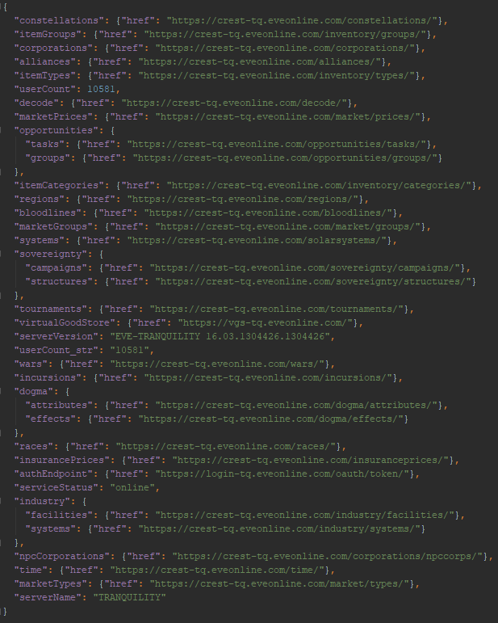
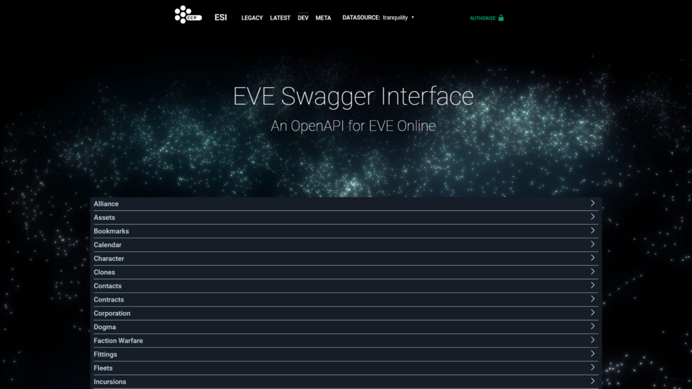
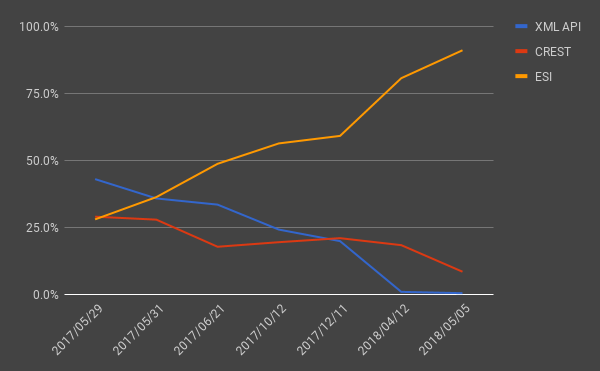
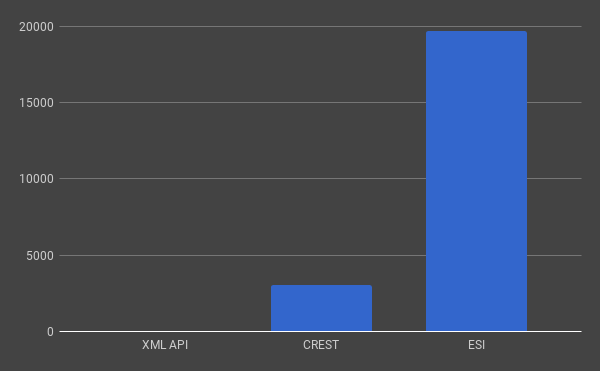
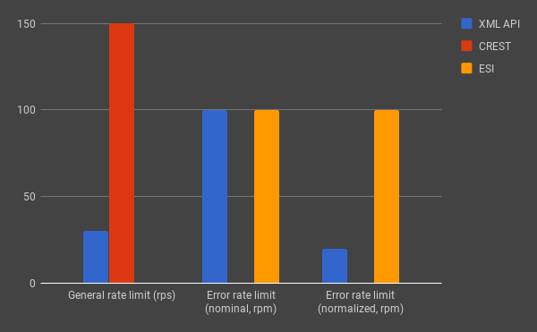
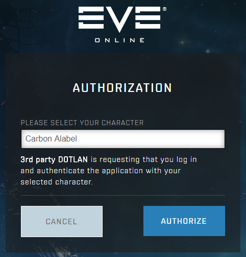

## ESI, the new and only EVE API

If you’ve recently been active in the greater EVE community, you should have picked up on one bit of news: that the big EVE API cataclysm, [announced 18 months ago](https://www.eveonline.com/news/view/introducing-esi), was coming up!

Developers will work overtime, unmaintained applications will go up in flames, alliances will weep, but those who emerge from the ordeal unscathed will be on a path to make many of even more wondrous creations!

Developers did indeed work overtime, and no doubt, even after the shutdown, some still are. Many popular apps have not been migrated to the new API, or the efforts to update them have failed. Alliances went up in arms about the many changes the migration to the new API would require, but in the end moved ahead, as the alternative wasn’t really an option. That last part about wondrous creations, I’m not so sure about.

And, as was announced, it happened. May 8th, 2018, at 11:00 UTC, the XML API and CREST have both gone down for one last time. They will be fondly remembered, by some people, at least.

Now, before their corpses have had much time to cool down, it’s time to trample all over them and talk about ESI, the new kid on the block.

### What is ESI, and how it compares to the XML API and CREST

First, a bit of background.

The XML API was the oldest of the three. Originally, it was known just as the EVE API, as, at the time, game APIs were a rarity. Only once the newer APIs were released did it really get that name, after XML, the file format which it returned, compared to the more modern JSON. It was read-only, and was able to provide information about many aspect of your characters and corporations, but was heavily limited by the fact that it interfaced directly with EVE’s database, and had no contact with the game servers themselves. As a result, it sometimes returned stale data (and there was some data it couldn’t get to), no kind of write access was possible (in theory, it would have been possible, but wouldn’t be a great idea), and used quite heavy cache times and rate limits, to limit the impact it had on performance of the database (though both could be bypassed without too much effort).

> 
>
> The root endpoint of CREST. Every other endpoint was possible to reach from this one by following the links, assuming certain in-game conditions were met.

CREST was the more recent API, designed with read/write access in mind (this write access was first used to integrate now dead [Dust 514](https://en.wikipedia.org/wiki/Dust_514) into the EVE Online universe), and was able to communicate directly with the game servers, opening up many new possibilities. Its name was shorthand for Carbon RESTful API (Carbon being the name of the framework EVE is built upon), and as suggested by it, it followed many of the RESTful API design principles, making usage of the API much easier, or in some cases, harder. It paved the way for many new features, such as self-documentation (no matter how incomplete and complicated to access it was), availability of various static and public data (the XML API mostly provided private data), writable endpoints (even if only two, contacts and fittings, were made available at first), remote UI endpoints (viewed by many as a regression from the in-game browser and the functionality available in it), and many more.

There was one major problem with it: structurally, it was a part of the game servers. This wasn’t so much of a problem because of the load it placed on them, but because it meant CREST had to follow the same stringent deployment procedures as the game itself did. Even the simplest change would have to wait for the next Tuesday, assuming some issue didn’t pop up elsewhere in the code base, forcing the relatively low-priority CREST changes to wait.

Aside from that, it lacked equivalents for a majority of the XML API’s many endpoints, meaning any serious app developer would likely have to rely on both of the API’s, preventing CREST from establishing itself as a proper replacement for the XML API.

> 
>
> The [new ESI UI](https://esi.evetech.net/ui/). Open it next to the [old one](https://esi.evetech.net/latest/), and play spot the differences.

Then we get to ESI, or the EVE Swagger Interface. To put it simply, ESI was designed to do everything the XML API and CREST (also some more minor APIs, such as the yearly character stats API, which was in its own way, [a precursor to ESI](https://github.com/esi/esi-issues/issues/121#issuecomment-263599034)) used to do, and to do it better. As [described by CCP](https://www.eveonline.com/news/view/introducing-esi):

> The ESI API is a RESTful, SSO authenticated, documentation first, buzzword compliant, horizontally scalable, read/write API.

Its documentation is based on the [Swagger](https://swagger.io/) framework (now known as [OpenAPI](https://www.openapis.org/)), it also relies on industry standard technologies instead of custom CCP-made ones wherever else possible, and most notably, isn’t run anywhere near the game servers. It’s instead running in the cloud, exchanging information with the game servers over a message queue.

This makes ESI much easier to maintain, as changes can be deployed almost instantly, indepent from the game servers (some more intricate changes might still require changes to the game servers), and most heavy loads should no longer directly affect the performance of the game servers. It’s also plays a role in what seems to be a part of CCP’s development strategy: outsource as many things as possible. It’s not only ESI that’s getting moved to a cloud platform: CCP has already done the same with the [chat system](https://www.eveonline.com/news/view/new-chat-backend-coming-with-the-march-release) (along with moving it to a standard chat protocol), and intends to do the same with the [new killmail system](https://github.com/esi/esi-issues/issues/842). These might be the most recent and notable, but they are not the only ones, nor are they limited to technical decisions: business decisions, such as outsourcing the (now almost abandonware) [EVE Portal app](https://www.eveonline.com/news/view/introducing-eve-mobile-portal) to a different development company, but that’s a story for another time.

### Stability and cloud platforms

If you ask anyone who has had to move their apps from the XML API and CREST to ESI how stable ESI is compared to them, they’ll tell you it’s much worse. Isn’t ESI supposed to be better than them? Why is it so?

This won’t be much consolation, but it’s natural. The design of an API such as ESI, with a high level of detachment from the source it gets most of its data from, necessitates a lot of moving parts, and a ton of moving parts rarely makes things more stable. Those same moving parts are also what makes ESI easier to maintain, so you could say that the increased incidence of problems is offset by the fact they can get solved much more quickly, which is true, as of the dozen or so (partial or full) ESI outages I can remember, few of them lasted more than a couple of hours. However, the fact remains that ESI is much more temperamental than the XML API or CREST ever were.

There’s another way to explain this increase in instability: cloud platform resilience is a big topic, so much that some people are saying that cloud providers are actually intentionally inducing failures in their platforms, in order to nudge their customers into designing more resilient apps. Who’s to say CCP isn’t doing the same?

Staying on the topic of cloud platforms, but moving away from conspiracy theories, ESI’s cloud platform migration is worthy of mention. This March (for reasons still unknown), CCP made a decision to move ESI from [Google’s cloud platform (GCP)](https://cloud.google.com/), which they had been using for all of their cloud projects so far, to [Amazon’s cloud platform (AWS)](https://aws.amazon.com/), along with moving ESI from the `esi.tech.ccp.is` domain to the `esi.evetech.net` domain. After a while, things went south.

> [Tweet by Team Tech Co on March 16, 2018](https://twitter.com/TeamTechCo/status/974680865300197376):
>
> Due to the events of the day and the instability of ESI after moving to esi.evetech.net it is necessary to move back to esi.tech.ccp.is. We will be disconnecting esi.evetech.net for the weekend. We apologize for the inconvenience

This tweet doesn’t mention the cloud platform migration, but it was the cause behind the instability.

When CCP decided to move all ESI traffic to AWS at once, ESI couldn’t handle the load (again, exact reasons still unknown) and this triggered a huge outage. After this fiasco, CCP was a bit more careful, and started [gradually proxying](https://developers.eveonline.com/blog/article/esi-march-news#a-b-testing) a percentage of incoming requests through GCP to AWS. They only recently made it to 100%, and made the switch official. Without any big problems, this time.

> [Tweet by Team Tech Co on May 3, 2018](https://twitter.com/TeamTechCo/status/992049219056812032):
>
> #ESI AB testing has finished and ESI is running completely on AWS now! The new URL is esi.evetech.net. All requests to esi.tech.ccp.is are being redirected there already and will do so for a while. #tweetfleet #devfleet

And with only 5 days to spare before the shutdown!

### Usage numbers

After the announcement, not everyone switched immediately to ESI. At the time, it lacked all the features required to replace both the XML API and CREST, and even after ESI reached that point, it would take time for app developers to actually migrate their apps. Looking at the chart of historical usage, you might notice some interesting patterns.

> 
>
> Usage chart of the three APIs, primarily based on historical updates provided by [CCP SnowedIn on Twitter](https://twitter.com/CCP_SnowedIn). Time axis not to scale, some values estimated.

The usage of CREST remained fairly stable throughout the transition period, while the XML API usage fell a bit more quickly, and they both started falling more rapidly after ESI reached near parity for that API. But can any useful information be gleaned from this chart? Not really.

The chart is based upon the raw number of requests processed by each API, and it just so happens that each API requires a vastly different number of requests to get a comparable amount of information, with the XML API requiring the least, ESI the most, and CREST sitting somewhere in between.

If you wanted to get a list of all active alliances in EVE, the XML API would, with a single request, return an XML document approximately 2MB in size, containing not only the list of all alliances with basic properties such as their name, ticker, executor, and member count, but also a list of all their member corps and the dates they joined the alliance.

If you were to do the same with CREST, you would have to first request the list of all alliances, which only provides the name and ticker, and which is spread over 13 pages. If you also wanted to know the details such as their biography, or the list of member corporations, you would need to make a separate request for each of the over 3 000 alliances.

Then there’s ESI. Again, you start by getting the list of all alliances. They are all listed on the same page, but they contain no information about them other than their ID, not even their name. In order to get such basic information, you need to make 3 000 or so requests, one for each of the alliances. If you also want to know the member corporation list, that will be another 3 000 requests. And if you need to know the member count of each of the alliances, it gets even more complicated, as you can’t get the number for the entire alliance. You need to find out how many members each individual member alliance has, and then sum those numbers up yourself. That will take a mere 14 000 additional requests.

To sum up: 1 request with the XML API, around 3 000 for CREST, and almost 20 000 if you’re using ESI, which we now all are.

> 
>
> Another chart, illustrating the amount of requests you might need to make to the different APIs in order to get the same information, because why not.

This might be a bit of an edge case, but it’s still a representative one. There is one other fact that contributes to the meaningness of request counts as a metric for comparing usage of different APIs. CREST and ESI make available a lot more information, on much shorter cache times. Two such examples are public market data, and character location data.

Fresh market data is available every 5 minutes, and getting the public market data for the entire universe will take around 100 pages of data. Assuming you get the fresh data as soon as it is available, you will be making around 30 000 requests a day. If you were to track the location, current ship, and online state of a single character, which is 3 requests every 5 seconds, assuming they stay logged in most of the day, that will be an additional 15 000 requests a day, per character.

With those numbers, it’s no surprise that EVE’s APIs handle tens of millions of requests every day. However, even a fraction of a percentage of those millions, that were recently still falling to the XML API, might be supporting several thousands of players, who might have no backup plans now the XML API is shut down.

Isn’t that their fault, though, for ignoring all the warnings over the last 18 months? It is, but it doesn’t make it any less sad.

### Rate limits

One of the things that was, if not promised, strongly implied, is that ESI would come with much more relaxed rate limits, and shorter cache times across the board. What changes does ESI bring in this area?

The XML API had a rate limit of 30 requests per second, which, while not insanely high, was good enough for most users of the API. In addition to that, it had an error rate limit, wherein if a certain user triggered more than 300 errors in a window of 3 minutes, they would be banned from the API for 15 minutes. CREST had a higher rate limit of 150 requests per second, with a burst limit of 400 requests, and no error rate limit, as it fit the increased amount of rapidly refreshing endpoints that could be requested.

ESI raised the bar even further, by having no rate limit! Developers could shower ESI with as many requests as they wanted, whenever they wanted, not having to worry about rate limits or avoiding them by using multiple IP addresses. Many developers did exactly that, and ESI handled it well, but it wouldn’t stay like that forever. After several months of no rate limits whatsoever, ESI was graced with an [error rate limit](https://developers.eveonline.com/blog/article/error-limiting-imminent), while still having no general rate limit. This error rate limit was set to 100 errors per minute, with the ban lasting only until the end of the minute, and still remains at those levels today. Those who didn’t make faulty requests or cause a ton of errors could still make requests to their hearts’ desire, while ESI’s stability would be safeguarded a bit better. Still, this particular change made many people angry. Why?

> 
>
> Another chart, probably the least informative one so far. It’s the last one, I promise!

Comparing ESI’s error limit (100 errors per minute, with the ban lasting less than a minute) to that of the XML API (300 errors per 3 minutes, with a 15 minute ban), it can be noticed that ESI’s is much more gentle. That doesn’t count for much, though. As mentioned above, what took only a single request with the XML API, can take several thousands of requests with ESI, and ESI can be pretty temperamental. So, assuming ESI is having a particularly bad moment, and through no fault of your own, starts throwing timeout errors on 5% of the requests you are sending it, after only 2 000 of them, you would hit the error rate limit. For the rest of that minute, you wouldn’t be able to make any further requests, leaving you with even more requests to make the next one, not to mention retrying those that failed, which will cause you to hit the limit even sooner, with no perfect solution to getting out of the loop.

It’s not just ESI acting up that is the problem. Many important bits of information, particularly those surrounding the new structures, which are going to become even more prominent with the upcoming [conversion of outposts to faction citadels](https://www.eveonline.com/news/view/faction-citadels-the-details), have no way of being retrieved other than making a request, and waiting to see if it fails or not. Many of these are intentional design decisions by the ESI team, made to safeguard the performance of the game and security of player data, but no matter how justified they were in making them, they remain by far the worst part of ESI.

Combine those two, and people are no longer looking at the error limit as the good guy that keeps out troublemakers, but as the big bad meanie that punishes them for events they had zero influence over.

There’s another way to explain the error limit’s bad image, and it has to do with how people perceive gains and losses. The phenomenon has a name, [loss aversion](https://en.wikipedia.org/wiki/Loss_aversion), and it amounts to this: losing something feels much worse than gaining something of equal value. When it was first revealed that ESI would have no rate limit (or an infinite rate limit), people were pretty happy about the upgrade. But when the error rate limit was announced, with ESI being as error prone as it is, they perceived it as a great loss.

Getting something and then having it taken away from you feels worse than never getting it in the first place, which is why many were so unhappy about it, even if most of them wouldn’t be significantly affected by the error rate limit, and didn’t really have any use for the infinite rate limit in the first place. Just giving ESI a much beefier rate limit (say, 500 rps) would have been the less controversial option here, but I’m glad we got to have just the error rate limit, troublesome as it may be.

### Cache times

Looking at the cache times in ESI, as a whole we can be very satisfied with it, but taking a closer look at some of the endpoints, things get a bit confusing. The cache times on several endpoints has been cut down by an order of magnitude compared to their XML API and CREST counterparts, but it’s the [several of them](https://github.com/esi/esi-issues/issues/546) that have actually been placed on longer ones that make no sense. The extra load shouldn’t be a big factor here: keeping the cache times as short as they used to be would only increase the load on those individual endpoints by a factor of 2 to 6, which would be nothing to the entirety of ESI with its over 200 endpoints. On top of it, the most prominent endpoint that has received this treatment is an interesting one.

The [wallet journal](https://esi.evetech.net/ui/?version=dev#/Wallet/get_characters_character_id_wallet_journal) endpoint isn’t just relied on for its usual purpose of looking through recent wallet changes; third-party developers who sell access to their apps for ISK (which is the only thing they can sell them for according to the [license agreement](https://developers.eveonline.com/license-agreement) they accepted) rely on it to automate the processing of those sales. What the increased cache time means is, customers have to wait longer after transferring the ISK before they get access to what they paid for. Waiting customers turn into complaining customers, and customer complaints make for unhappy developers.

### Parity

Does ESI actually have full parity with the XML API and CREST? There’s two kinds of parity to consider here, functional and feature parity. As described in the section above, we most certainly do not have functional parity, as the process of getting some information may vary drastically between any of the three APIs. When it comes to feature parity, we’re 95% there. Pretty much every endpoint from the XML API and CREST has its counterpart in ESI, but there are still a few pieces of non-vital information missing here and there. However, if you’re willing to include more than the XML API and CREST in parity, there’s more to be done.

The in-game browser (IGB) used to offer a number of useful functions, with most of them being the equivalents of what are today knowns as remote UI endpoints. When it was [removed](https://www.eveonline.com/news/view/bidding-farewell-to-the-in-game-browser) in October of 2016, only a fraction of the functions (the most used ones) received equivalent CREST endpoints. The others, which had low, but presumably non-zero usage, were left with no replacement, those players relying on them left with no alternatives.

One of the most important ones is [opening a prefilled window to transfer ISK](https://github.com/esi/esi-issues/issues/190). Used in the past by organizations all over the EVE universe, most often for ship replacement programs, people running them are now left with an even more tedious process than repeatedly pressing enter to confirm the ISK transfer dialogs as they popped up, and likely developing a case of carpal tunnel. While one of the ESI developers has come up with an idea for being able to queue up multiple payments and execute them all at once, such as system is probably still a long time away, and immediately getting a direct replacement for the lost functionality would likely be preferred by many.

One of the stated aims for ESI was for it to be the only API you need to build an app for use with EVE, but there is still much information which requires the use of the [EVE static data export (SDE)](https://developers.eveonline.com/resource). It is a massive archive, measuring at around 100MB, containing almost all the data describing the EVE universe. It is so large and so complicated that several prominent third-party developers are regularly releasing conversions of the SDE which make it easier to use, or providing APIs to access only a part of the information it provides, instead of having to download the entire 100M archive. The ESI team has expressed interest in making all of the data from the SDE available over ESI, but same as with the IGB functions, don’t appear to have made any progress in that direction so far.

Even without the tons of requests for completely new features, with more coming every day, the ESI team has quite a lot to work on, but they did get ESI to a point where it can, for almost all intents and purposes, replace the two APIs which have been shut down, which was their goal all along.

---

### The future of ESI

Just because the older APIs have been shut down, and parity with them reached, doesn’t mean that the ESI developers will be getting any rest, or going back to working on ship model redesigns. Here are some things we know about how ESI is going to be developed in the future.

### WebSockets

[WebSockets](https://en.wikipedia.org/wiki/WebSocket) are a protocol used for two-way communication, and we should soon™ be able to use them to interact with ESI. They have already been used by ESI internally for several months, and it’s going to take even more time to get them ready for use by third-party developers, but once they become available, those who start using them will benefit greatly.

It will no longer be necessary to repeatedly send requests to ESI to see if any changes occurred; instead, for supported categories of data, it will be possible to start a WebSocket connection to ESI, and have ESI send us a message when they do. This would not only result in bandwidth savings, and make the app design easier (though that depends on the developer’s language of choice), but also provide more timely data, unconstrained by ESI’s cache timers.

The two endpoints which have been presented as the most likely candidates for availability over WebSockets are killmails and character location data, though for both of those, no changes will be apparent to most end-users. Killboards will be able to automatically process new killmails immediately after you get them, as opposed to the current delay of up to two minutes. Character location data, primarily used by wormhole mappers, won’t be much more accurate, as it’s already on a tiny 5 second cache timer, but the mappers won’t be required to shower ESI with thousands of requests for every character, most of them returning no new data.

It remains to be seen how much of this will actually be implemented, but it is one of the things about ESI I am looking forward to the most.

Prioritization of issues
The proper way to report bugs and submit feature requests for ESI is over at the [esi-issues GitHub repository](https://github.com/esi/esi-issues). If you take a look, you’ll see that there are hundreds of issues already open. With so many of them, and some of the ESI team no doubt having some projects and ideas of their own, which ones are they going to get to first?

> 
>
> You could say that this isn’t vote brigading, but when the top issue has almost double the thumbs up of the [next most upvoted one](https://github.com/esi/esi-issues/issues/61) (which is much more interesting) and they are mostly by users who haven’t previously participated in the repository, there isn’t much point in calling it something else.

If you ask them, they’ll say that bug reports are top priority. Once the most serious of them are fixed, they will start moving onto feature requests. There are about twice as many of them as there are bugs reported, and they vary in complexity from simple ones asking for a missing property to be added to a single endpoint, to those asking for an array of endpoints to give coverage for a part of EVE which was never before available over an API. One of the things that will affect which ones they start working on first is how many [thumbs up](https://github.com/esi/esi-issues/issues?q=is%3Aissue+is%3Aopen+sort%3Areactions-%2B1-desc) they have, so if you see one you would like to see implemented sooner rather than later, don’t be shy and give it a thumbs up! Others are already doing so! It just so happens that we’ve already had our [first case of vote brigading](https://github.com/esi/esi-issues/issues/349).

For another item of not so positive news, we’ve had the discussion in a couple of issues get so heated that the ESI team had to step in, lock the issue, and delete most of the comments. Luckily, the situations weren’t *that* bad, and no contributors have been banned due to them. Yet.

### The EVE SSO

While the SSO is not technically part of ESI, it is nonetheless an essential part of utilizing the full potential of ESI. Like ESI, SSO now has its own channel on Tweetfleet Slack, it’s own [sso-issues](https://github.com/ccpgames/sso-issues) repository on GitHub, and at least [one of the developers](https://twitter.com/stebets) working on it staying in touch with us, and having such a continued presence is the single most valuable thing they could do. As a result of that, we already know about some of the upcoming changes.

> 
>
> Pending some of the more technical changes, the SSO authorization screen has gotten a fresh new look.

The biggest one is the move to [JSON Web Tokens](https://jwt.io/) as the authentication method used for ESI. This change won’t affect end-users in any way, but for the developers, it will mean having to make fewer requests to the SSO, so even if the new tokens will use some extra bandwidth, the SSO as a whole might get a fair bit faster.

More likely to be noticed by end-users is support for the nondescriptly named [PKCE](https://oauth.net/2/pkce/). Desktop apps which are using ESI have to rely on the SSO, and because of security concerns, many of them require require users to register their own app on the [EVE Developers](https://developers.eveonline.com/) portal. This is a problem, not only because it’s inconvenient, but also because it’s impossible to do for some players. Registering a new application requires you to agree to the [Developer License Agreement](https://developers.eveonline.com/license-agreement), which for reasons of identification can only be done by those who have previously made a payment to CCP with their accounts. This rules out many players, mainly those who are Alpha accounts or have always used PLEX bought in-game to subscribe their accounts. Once support for PKCE is added to the SSO, app developers will be able to remove the requirement for users to register their own apps, making things easier for everyone.

Not related to ESI, but still interesting, is [making EVE players aware of when their passwords have been compromised](https://twitter.com/stebets/status/989907333441605632). Based on the recently released password API from [Have I Been Pwned](https://haveibeenpwned.com/), it securely compares the entered password to an immense list of passwords previously leaked in various security breaches across the world. If it matches one of those, the player will be met with a warning that they are using an insecure password, and a suggestion to change it. Many people will probably just click right through the warning, but it never hurts to try and make people’s accounts more secure.

### Final remarks

18 months after the announcement, we finally made it. The XML API and CREST are dead, ESI has replaced them and is capable of covering essentially all the use cases they had. It is not without its quirks, introducing many new paradigms to the world of EVE third-party development, and doing away with just as many of the old ones everyone was used to.

It will take some getting used to, both by the developers and the users of the apps, and even after the shutdown, work is still underway by multiple teams at CCP trying to make this transition as painless as it could be. The ESI team had a great challenge in front of them, and knowing the stories about how hard it is to work with EVE’s code, it’s no wonder they didn’t manage to build an excellent API, but they should be commended for managing to make what is so far a fairly good one.

It has been an exciting 18 months, and I believe the next 18 will be even more so. Looking forward to them.

---

*After the writing of this text, I discovered that CREST wasn’t in fact shut down, but was instead limited to internal access only as certain parts of EVE still rely on it. This is me, officially calling out CCP on cheating.*
