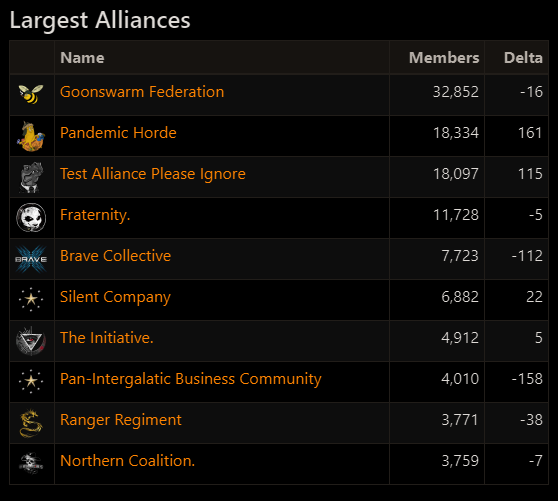

## I made an assumption

My assumption was proven wrong soon after.

---

On August 23rd, [Squizz Caphinator](https://evewho.com/character/1633218082), the person behind [zKillboard](https://zkillboard.com/) and associated projects such as [EveWho](https://evewho.com/), [open sourced](https://github.com/zKillboard/evewho) the new version of EveWho. It was a nice fresh start, touted as mobile friendly, and written in Node instead of PHP, like zKill is, and the old EveWho was. While it didn’t yet have all the features of the old version, I was interested in a feature the old version didn’t have either: a dark theme.

Instead of waiting for Squizz to get around to implementing one, I decided to try doing something about it myself. I also wasn’t going to put too much effort into it, so I went for the [`invert()` CSS filter](https://developer.mozilla.org/en-US/docs/Web/CSS/filter-function/invert). Just inverting the entire page is so much easier than writing or finding a whole new theme!

One problem you might see with this approach is that the entire page isn’t just black text on white background. All the colored text and images get inverted as well. This doesn’t have to be a bad thing, as the blue links got shifted to orange, an appropriate link color for an EVE companion site. As for the images, two wrongs can make a right! The images just get inverted again, and the end result of what is really just two lines of CSS is a surprisingly nice dark mode:

> 
>
> How long will these alliances stay the largest alliances?

So nice, in fact, that Squizz asked for a [PR](https://github.com/zKillboard/evewho/pull/6). This is the point at which I decided to put in a bit more work.

---

This “more work” consisted of adding a toggle link to the bottom of the page, allowing people to choose whether they want to use the dark mode. Just because I like my sites in dark mode, doesn’t mean everyone does, and users should be able to choose which one to use. This toggle link required some JS logic to work, and this is where I made the assumption: that light mode is the default one, and that it will stay that way.

Turns out, Squizz had something different in mind. After trying it out and liking it, dark mode was made the default one. This, of course, broke all my JS that I had written with the assumption to the contrary, and made it impossible to use the light mode without manually changing it on each page visit, which required you to use the toggle button twice, because, if you’ll remember, I assumed the light mode would be the default one.

---

I’ve since opened [another PR](https://github.com/zKillboard/evewho/pull/9), which should work better no matter which mode ends up being the default, and I don’t think many people were hurt by this incident. Time to reminisce on the important life lessons I have learned from it.
