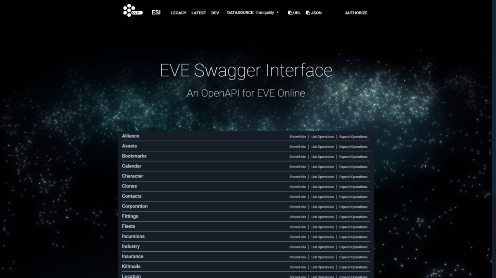
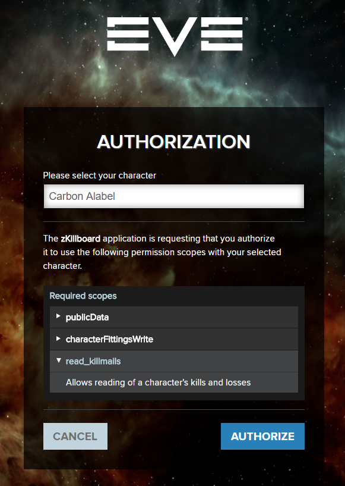
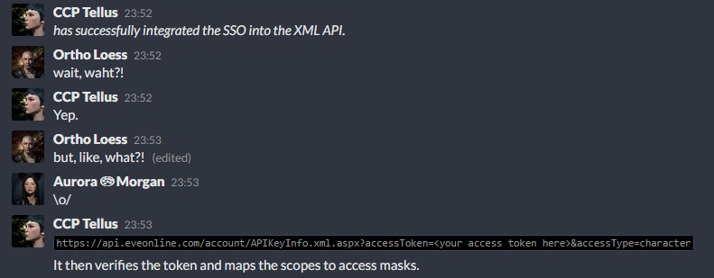
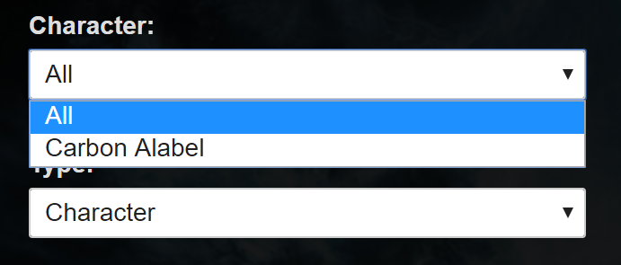
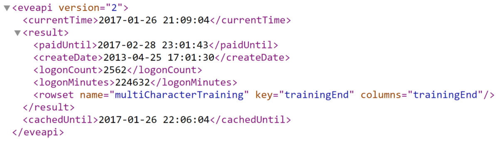

## The removal of API keys and the future of API checks

Just over two months ago, a pair of dev blogs titled “[Introducing ESI — A new API for EVE Online](https://www.eveonline.com/news/view/introducing-esi)” (on the community site) and “[Introducing the ESI API](https://developers.eveonline.com/blog/article/introducing-the-esi-api)” (on the third party developers site) was released by CCP, announcing ESI: a new API designed to be a replacement for the older XML and CREST APIs, along with a target for achieving functional equivalence between the new ESI API and the two older ones, at which point the older APIs would be shut down: 18 months from release of the blog(s).

> 
> Home page of the new API. Pretty, isn’t it?

Now, we can safely assume that the API development team will run into some unexpected problems, placing the project behind schedule, and that once functional equivalence is achieved, a final warning will be sent out, giving developers who still hadn’t begun migrating to the ESI API a couple of months to do so before CREST and the XML API are shut down for good. Still, in about one and a half years from now, those two APIs are going away. What does that mean for you?

First of all, leaders of corps and alliances (and other types of organizations operating within EVE) will need to ensure their auth systems and other apps no longer rely on the older APIs. Third party developers have the most work in front of them: updating their apps to use ESI and the dreaded EVE SSO (single sign-on). If their apps completely rely on the XML API, they have a lot of work in front of them, but those already relying on CREST shouldn’t find the transition process to be very complicated. And for the end users, there will be a single, very obvious change: **API keys are going away**.

Of course, that does not mean there will not be a way to share your private information anymore. API keys are being replaced with the SSO, which has been available for use with CREST for over two years, and with the XML API for slightly less than a year. However, the SSO does not cover *all* use cases provided by API keys, and these differences may be important to some people. Before telling you about those, I’ll go over the history of authentication methods used by EVE’s APIs and how they changed over the years. If you just want to find out what those differences are and don’t care much for context, scroll to the bottom for a tl;dr.

### Legacy API keys

The first authentication method used by EVE’s XML API were what are now known as legacy API keys (in their time, they were known just as API keys). Legacy API keys served their purpose, but also had some very bad limitations.

First one was their granularity, or the lack thereof. Unlike the API keys we currently use, there were only two permission levels: you could create a limited API key or a full API key. A limited API key allowed for access to the character sheet (which hosts information such as your skills, implants, attributes, corp roles, wallet balance and some other basic information), skill queue and NPC standings. On the other hand, a fully API key (as indicated by its name) allowed for full access to all character information available over the XML API, as well as certain corporation information, as dictated by the character’s roles in the corporation. Both types of API keys were account wide.

If that wasn’t enough, there was a security flaw with legacy API keys: at any given moment, you could only have two active API keys: one limited and one full API key. If either got leaked, and you wished to plug the leak, you had to generate a new API key, invalidating the old one, and forcing you to redistribute the new API key to any legitimate consumers. Without doubt, this caused headaches for many people. To overcome those issues, a new generation of API keys was introduced: customizable API keys.

### Customizable API keys

[Customizable API keys](https://www.eveonline.com/news/view/power-to-the-end-user-customizable-access-api-keys) (now mostly known only as API keys) were introduced to fix the flaws of legacy API keys. Instead of only having two levels of permissions, access could now be defined on a much finer basis with the use of access masks: you could give permission to someone to read your contacts without also letting them read your asset list, or let someone view the subject, sender and recipient info of your mails, but not the contents of the mails themselves. Corporation and character level access was separated, and API keys could be limited to a single character or be account wide. You could also set an expiration date, to have your API key expire after a set amount of time, and were no longer limited to two API keys, allowing you to create separate keys for different applications.

The only *downgrade* made by customizable API keys was to corporation API access. Corporation API keys were now separate from character keys, and could only be created by directors, meaning that a character with the Junior Accountant role could no longer use their full API key to view the corporation’s transaction info, but had to ask a director to create an API key with the appropriate access mask for them.

### Introduction of CREST and the EVE SSO

Fairly soon after the introduction of customizable API keys, the next generation [CREST API was announced](https://www.eveonline.com/news/view/introducing-the-free-ccp-developer-license-and-the-crest-api-beta-test-period), which would allow developers to create apps which connect with EVE in a much more interactive way than it was possible with the XML API. What did they mean by more interactive? For one thing, that it would be more responsive, with much shorter delays between something happening in game and it being reflected in the API. The most important thing? Write access: in addition to reading your list of contacts, you would also eventually be able to edit it from outside the game.

This got many people excited, but the higher level of interactivity wasn’t to be utilized by third party developers and their apps for a while. It was first used internally by CCP for development of their destined to fail FPS [Dust 514](https://en.wikipedia.org/wiki/Dust_514), in which EVE Online players could help Dust players on the ground with orbital bombardments, while the conquests of Dust players would confer bonuses to operations in space. Before it was opened up to third party devs, a new authentication method was required, preferably one which did not involve the oh-so-easy to steal API keys. Think someone reading your mails and contact list was bad? Imagine someone reading your mails and your contact list, then completely deleting them with no way for you to restore them.

To solve this problem, and also provide a nice service to EVE players and third party developers alike, CCP decided to roll out their own implementation of the [OAuth 2.0](https://oauth.net/2/) standard, and [EVE SSO was born](https://www.eveonline.com/news/view/eve-online-sso-and-what-you-need-to-know). Much like you can log into your EVE account using your Facebook or Steam accounts (assuming they are connected), you could now log into third party sites and applications using your EVE account; to be precise, using one of the characters on your EVE account.

> 
> SSO authorization site which you will arrive to when logging into [zKillboard](https://zkillboard.com/). Notice the character selection drop down menu, and the list of scopes which were requested by the app.

Whereas API keys have access masks, SSO uses scopes for access control. If you want to give an application read and write access to your contact list, you need to log into it with your EVE account, select the character for which you are providing access and authorize the application to use the scopes it requested.

This new authentication method didn’t receive a completely positive response from the community: while it removed the need to copy-paste API keys into applications, making the authentication process much simpler, EVE’s more paranoid players didn’t like the idea of their EVE account login details going anywhere near third party sites (even though their login details never leave CCP’s site), or the fact that you couldn’t audit all requests made by the app like you could with the XML API. There were also some third party developers outraged by the increased amount of effort that would have to be put into enabling SSO authentication, compared to the two text boxes that were needed for users to enter an API key.

### SSO meets XML API

For all its benefits, the SSO had one major limitation which held back its adoption: it could only be used to access private information over the CREST API. Compared to the XML API, it severely lagged behind with regards to the amount of information which could be accessed over it. This would be taken care of with the [Citadel expansion](https://www.eveonline.com/news/view/patch-notes-for-eve-online-citadel).

> 
> The integration of the SSO with the XML API was first announced in [the place where all the cool kids hang out](https://tweetfleet.slack.com/messages/devfleet/). And then quickly [posted on reddit](https://www.reddit.com/r/Eve/comments/4e3947/rip_api_keys_you_wont_be_missed/). By me. I really do have an axe to grind with those pesky API keys, don’t I?

CCP Tellus did some work, making access to the XML API possible using SSO access tokens. A number of new SSO scopes was introduced, which had corresponding XML API access masks assigned to them, making private information on the XML API accessible using the SSO. It is a somewhat hacky and half-baked solution, but one that nonetheless managed to bridge the gap between the still ubiquitous XML API and the SSO.

Not everyone was satisfied with this, as using the XML API over the SSO still only provided access to a single character’s info: the SSO does not provide account level access in any way. Or does it?

### Why every alliance requires a full API key

API key checks are a big thing when it comes to recruitment in EVE, and any alliance (or corporation, or any other kind of organization) that thinks highly of themselves will require a full API key before they let you join. With the XML API now supporting the SSO, you might think that those organizations would be racing to move to this safer and simpler alternative to API keys.

They didn’t.

Turns out, the lack of account level access is a no-no for the decision making people in those organizations. Why do they require account level access? **Because they can.** Account level access was the only kind of access possible with legacy API keys, so when customizable API keys were introduced, account level access was already the norm, and the difference between creating an account wide and a single character API key is a single dropdown menu on the API key creation page. It doesn’t take any extra effort, and it’s not like you [have anything to hide](https://en.wikipedia.org/wiki/Nothing_to_hide_argument).

> 
> The difference between creating a single character and an account wide API key. If you’re already signing off the soul of your firstborn, might as well make it all three of your kids!

What do those organizations do with the extra information provided by the account wide API key? Not much. For most people, all the information it will reveal is the person’s two PI chars, but the assumption goes like this: a potential spy will use one of their spare character slots to create a spy character, so by performing an account wide API check, we are stopping those spies from joining us.

If you asked any experienced recruiter how many spies they have outed using this method, the answer will likely be zero. Any experienced spies will use a different, clean account anyway, and the added cost of maintaining another subscription won’t matter to them.

**There should be no way to associate the characters on the same account with each other.** When you pay for your subscription, you are paying for three character slots, and you should be able to use them as you wish, without nosey alliances and corporations having a say in it, and the SSO is a move towards that.

Not really.

### The account wide scope

When the SSO was connected with the XML API, it was also given a single account wide scope. Its name is `characterAccountRead`, it is assigned the XML API access mask `33554432`, and it grants access to the XML API endpoint `/account/AccountStatus.xml.aspx`, which, as you may have guessed from its name, provides information about the status of your account as a whole. The output of that endpoint looks something like this:

> 
> 155 days of time spent logged in with my main character. Not even half a year. I know, pathetic.

While you can’t use that scope to explicitly get the list of characters on an account, what you can do is require potential recruits to fill all three character slots on their account, use the SSO to grant you access to all of them separately, and then visit that endpoint as each of the characters. If the info provided by that endpoint matches across the three characters, they are almost certainly on the same account.

What does this mean? It means that organizations can still perform account wide checks using the SSO, but it requires more effort than what was required with API keys.

### Account information in ESI

I’ve covered what can be done right now, but with the XML API (along with API keys) and CREST on their way out, it won’t matter for long. What does ESI hold in store? It is still very much an unfinished product, but CCP devs have been fairly talkative about its development, so we have something to go on here. Take this [comment by CCP Chimichanga from the ESI issue tracker on GitHub](https://github.com/esi/esi-issues/issues/95#issuecomment-263623670a):

> By no means will we be exposing account specific information on the character level. This was a large discussion with the CSM.
>
> What will be happening for the skills endpoint is the addition of “active skill level”. This should solve the skill training calculation problems. This may also need to include a “potential skill level” as well. That would be a more important discussion to have on another issue.

Other comments on the same issue are pretty interesting, but what they amount to is this: **ESI will not expose any account level information directly, but it will still be possible to infer some of it based on character level information.** Also, the CSM seems to agree with me on that the characters on an account should stay separate, which is something I was really glad to see.

Let’s go back to the problem of figuring out the identity of all characters on a single account, this time using ESI, or rather what we can expect from it, as the “active skill level” from that comment hasn’t been implemented yet. Can we do it, and how?

The active/potential skill level would tell us if the character is an Alpha or an Omega, which is pretty much the same thing as the `paidUntil` property from the XML API endpoint mentioned above. When the player subscribes or his subscription ends, those properties would change to indicate that, at the same time for all three characters. Yes, we can! So, all we need to do is have the recruit grant us access to all three characters on their account, and send them a mail like this one:

> *Dear {recruitName},*
>
> *Your application to join our corporation has been received, and you have successfully logged into our auth system with all three characters, as required.*
>
> *To complete the registration process, please allow your EVE Online subscription to expire for a short period of time. This will let us confirm your identity, and assuming no issues are encountered during this final screening procedure, you will be allowed to join our corporation.*
>
> *Sincerely, leadership of ParanoidCorp Inc.*

Yeah, no.

You can still associate the characters on a single account with each other, but it is no longer a straightforward process, or one that any sane person would be willing to deal with.

Will getting (and confirming) account level access still be possible? Yes, but it will be far too complex for anyone to bother with it. In my eyes, that’s a win for privacy.

### Some other considerations

There are things other than the changes to account level access to consider. Despite account level access going away, **the amount of information accessible on the character level is going to increase**. Once all the functionality present in the XML API and CREST is implemented in ESI, there won’t be much else to do but work on new features! Initially, those features will most likely take the form of performance improvements or simplified access to information which was already available somewhere else, but later on they will provide access to loads of information which wasn’t accessible before. One day, we might even see the possibility of joining in-game chat channels outside the client! While those will allow the third party developer community to build some even more amazing applications, they will also represent another avenue that some organizations may want to use to spy on their members.

However, one great thing about this move is that developers who wish to use EVE APIs to create apps will have to accept the [EVE third party developer license agreement](https://developers.eveonline.com/license-agreement). Accepting this agreement is a prerequisite for being able to register an app to use with the SSO, which wasn’t required when using the XML API with API keys. Among all the legalese dealing with copyright and what not, one section in particular is of special interest to all end users. That is section 2.3.

> Developer acknowledges and agrees that no Application shall be used
>
> (a) to inject, deliver, or activate malware, worms, Trojan horses, or other bugs,
>
> (b) as a means of phishing or spamming,
>
> (c) as a means of tracking Player information or Player activity without the express knowledge and consent of such Player,
>
> (d) as a means to misappropriate a Player’s in-game items or other information, or to otherwise cheat, scam, or defraud Players who subscribe to the Application, or
>
> (e) as a means of implementing a denial of service attack, distributed denial of service attack, or other method of disabling or denying access to EVE or the Licensed Materials. […]

**Developers may not use their apps to cheat, scam, spy, or do any of the other things EVE players are well known for doing to each other!**

Will this stop an unscrupulous developer from building a mail management app and selling the contents of their user’s mails to any interested parties? Not really. That kind of thing would be impossible to prevent and really hard to detect, so you should still avoid just giving any nifty looking application full access to your character info, especially if you don’t know or trust the developer.

Like most contracts, that license agreement isn’t meant to make it impossible for violations to happen. Its purpose is to deter the involved parties from even considering to do so. Don’t think that is good enough? It’s better than nothing.

### TL;DR

If you managed to read through all of this, congratulations. Hope you didn’t find it too boring. If you’re just here for a summary, here are the important parts:

 * API keys are going away. They are being replaced with the EVE Online SSO, a safer and faster alternative, in which you use your EVE Online account to log into third party apps. Account level access will no longer be possible, and you will only be able to grant access to one of your characters at a time.
 * The older XML and CREST APIs are being deprecated and replaced with ESI, a more modern, performant and easier to use API. Third party developers will have to transition their apps to use ESI, and they might benefit from better documentation, improved performance, shorter cache timers, and many new features which will be added to it.
 * Third party developers and their apps will, due to a license agreement, no longer be permitted use their apps to scam and spy on their users. However, this won’t actually stop them from doing that, so if you care about your privacy the tiniest bit, avoid giving access to your private information to any cute third party apps you stumble upon.

---

*Note: This text is based on information available to me at the time of writing it. I cannot guarantee the accuracy of any predictions made here, or that future changes to CCP’s policy won’t render some of them obsolete.*
